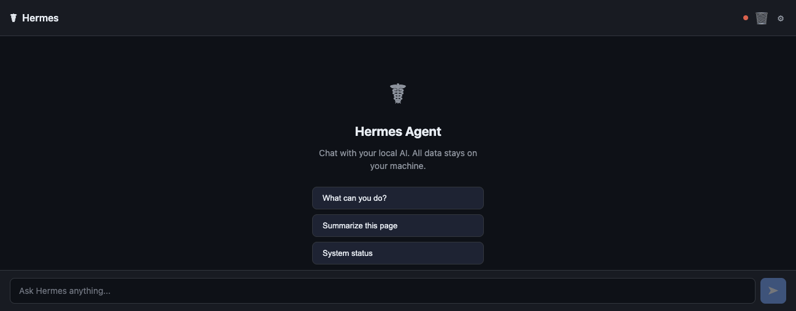

# Hermes Chrome

Hermes Chrome is a side panel for talking to a local Hermes Agent gateway without leaving the page you are on.



It gives Hermes a browser-native front end: open the panel, ask a question, optionally include page context, and keep the conversation tied to your local runtime.

## Highlights

- Side panel chat that stays available while you browse
- Local gateway detection and connection testing
- Optional page-aware prompts using title, URL, language, and visible text
- Hermes session API support so conversations can live in Hermes history
- Runtime controls for provider, model, and base URL
- Slash command palette for faster prompting
- Local storage only, with no bundled analytics

## Quick start

1. Open `chrome://extensions`.
2. Enable Developer mode.
3. Click **Load unpacked** and select this folder.
4. Open the Hermes side panel from the toolbar icon.
5. If Hermes is not on the default gateway, open settings and run **Auto-detect Gateway** or enter the URL manually.
6. Use **Test Connection** before starting a chat.

The default gateway is `http://localhost:9119` (Hermes WebUI), which exposes an OpenAI-compatible `/v1/chat/completions` endpoint. If you run the Hermes Python API server separately, it defaults to `http://localhost:8642`.

## Settings

- **Gateway URL**: Hermes gateway address, defaulting to `http://127.0.0.1:8642`
- **API key / bearer token**: only needed if Hermes expects `API_SERVER_KEY`
- **Provider / model / base URL**: loaded from Hermes runtime config and optionally applied back
- **Include page context**: adds page title, URL, language, and visible text excerpt to messages
- **Use Hermes session API**: keeps the conversation in Hermes when supported
- **Stream responses**: used on the OpenAI-compatible fallback path
- **System prompt**: default instruction sent with conversations
- **Reset to defaults**: clears local settings and cached conversation data

## API behavior

Preferred endpoint:

```text
/api/sessions/{id}/chat/stream
```

Fallback endpoint:

```text
/v1/chat/completions
```

Additional reads:

```text
/api/config
/api/available-models
/api/skills
```

## Slash commands

Type `/` in the input to open the command palette.

- `ArrowUp` / `ArrowDown` moves selection
- `Tab` or `Enter` accepts the selected command
- `Escape` closes the palette
- `//` sends a literal message starting with `/`

## Privacy

- Talks to loopback addresses by default
- Stores settings and chat cache in `chrome.storage.local`
- Does not include telemetry, analytics, or remote third-party calls

## Development

```bash
node --check background.js
node --check sidepanel.js
node --check options.js
python3 -m json.tool manifest.json >/dev/null
```

## Troubleshooting

- If the panel loads but will not connect, verify Hermes is reachable at the configured gateway URL.
- If auto-detect misses your server, enter the gateway URL manually and rerun **Test Connection**.
- If requests fail with auth errors, set the same token Hermes expects for `API_SERVER_KEY`.
- If provider or model controls are empty, confirm the gateway works first, then reload runtime settings from Hermes.
- If page-aware prompts feel noisy, disable page context and resend.

## License

MIT
